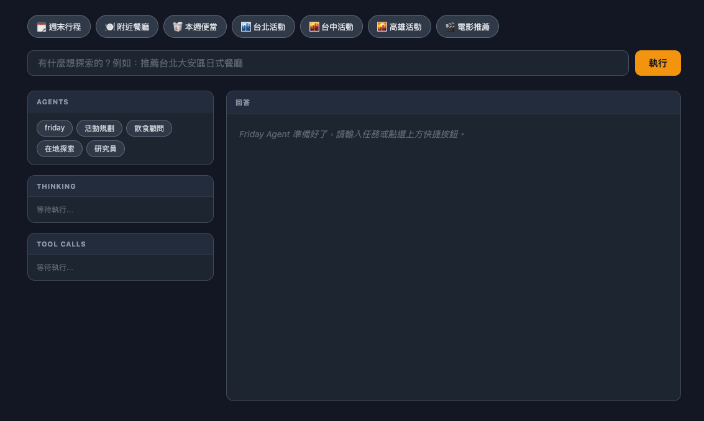
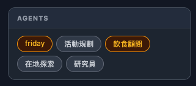
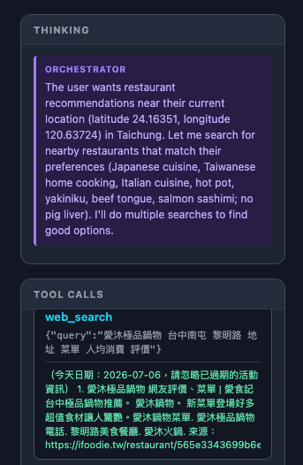
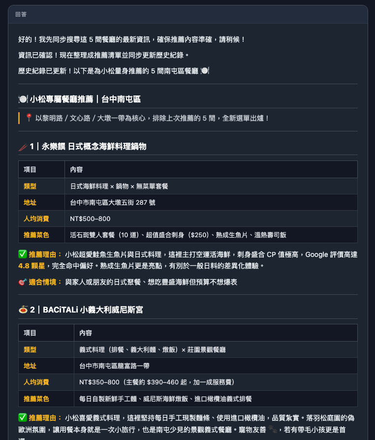
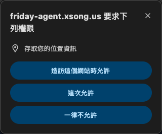

# Friday Agent — 美好生活 AI 助理

一個以 Claude API 實作的個人生活推薦系統，可視化 Agent 決策過程，即時展示 thinking、tool use、multi-agent 協作的完整流程。

  

**Live Demo：[friday-agent.xsong.us](https://friday-agent.xsong.us)**

---

## 功能

- **週末行程規劃** — 週五下班到週日的完整活動安排
- **餐廳推薦** — 根據個人口味推薦附近餐廳
- **便當計畫** — 一週便當料理與採購清單
- **各城市活動** — 台北、台中、高雄、東京、倫敦近期活動
- **電影推薦** — 根據喜好推薦當週上映電影
- **Extended Thinking 視覺化** — 即時顯示 Claude 的內部推理過程
- **profile.md 記憶庫** — 儲存個人偏好，每次查詢自動帶入

---

## 截圖

### 主介面


上方快捷按鈕可一鍵觸發常用任務（週末行程、附近餐廳、本週便當、各城市活動、電影推薦）。左側三個面板分別顯示 **Agents 狀態**、**Thinking 推理過程**、**Tool Calls 工具呼叫**，右側為最終回答。

---

### Agent 狀態面板


執行中的 Agent 會亮橘色，完成後轉綠色。此截圖顯示 `friday`（主 orchestrator）與 `飲食顧問`（sub-agent）同時 active，代表 multi-agent 協作正在進行。

---

### Thinking 推理 + Tool Calls 視覺化


**THINKING** 面板即時串流 Claude 的內部推理，可看到 orchestrator 根據使用者的 GPS 座標（台中，24.16351, 120.63724）與 profile 中的飲食偏好，決定搜尋策略。**TOOL CALLS** 面板顯示每次 `web_search` 的查詢參數與原始回傳結果。

---

### 餐廳推薦結果渲染


最終回答以結構化 Markdown 呈現，每間餐廳列出類型、地址、均消、推薦亮點，並針對 profile 中記錄的個人偏好（日式料理、義式料理、不吃豬肝）給出客製化說明。

---

### 瀏覽器 GPS 授權請求


點擊「附近餐廳」時，前端會向瀏覽器請求地理位置權限，取得座標後直接帶入查詢，讓 Agent 推薦真正在你附近的店家。

---

## 專案結構

```
friday-agent/
├── main.py              # FastAPI server，SSE 串流 + profile API
├── orchestrator.py      # Agent 核心：決策迴圈、tool dispatch、multi-agent
├── profile.md           # 使用者偏好記憶庫（可直接編輯）
├── tools/
│   ├── web_search.py       # DuckDuckGo 真實搜尋
│   ├── calculator.py       # 數學計算
│   ├── current_time.py     # 取得目前時間
│   ├── file_read.py        # 讀取本地檔案
│   ├── profile_manager.py  # 讀寫 profile.md
│   ├── bento_manager.py    # 讀寫便當計畫歷史
│   ├── it_ops_guardrail.py # IT 維運高風險操作攔截 + 稽核紀錄
│   ├── it_knowledge_base.py# 內部 runbook 知識庫搜尋（簡化版 RAG）
│   └── it_ticket_router.py # ITSM 工單分類 / 優先級判定
├── agents/
│   ├── event_planner.py   # 週末活動規劃 agent
│   ├── food_advisor.py    # 餐廳推薦 + 便當計畫 agent
│   ├── local_scout.py     # 在地活動 + 電影查詢 agent
│   ├── researcher.py      # 資訊研究 agent
│   ├── coder.py           # 程式碼 agent
│   ├── critic.py          # 審查 agent
│   └── it_ops_advisor.py  # IT 維運顧問 agent（Guardrail / 知識庫 / 工單分類）
├── runbooks/               # 內部 IT 支援知識庫範例文件（刻意不放在 data/ 底下，見下方說明）
└── frontend/
    └── index.html       # 視覺化 UI，含快捷按鈕與 Markdown 渲染
```

---

## 快速開始

### 1. 安裝依賴

```bash
python3 -m venv venv
source venv/bin/activate
pip install anthropic fastapi uvicorn python-dotenv duckduckgo-search
```

### 2. 設定 API Key

```bash
cp .env.example .env
# 編輯 .env，填入你的 ANTHROPIC_API_KEY
```

**選用：LiteLLM 為主、官方 API 為備援**

在 `.env` 額外填入 `LITELLM_BASE_URL`（與選填的 `LITELLM_API_KEY`、`LITELLM_MODEL`）後，
所有請求會優先打向 LiteLLM proxy；只有在**建立連線這一步就失敗**（LiteLLM 掛掉、連不上、回傳非 2xx）時，
才自動 fallback 回上面的官方 `ANTHROPIC_API_KEY`。已經開始收串流之後才發生的錯誤不會重打，避免內容重複輸出。
不設定 `LITELLM_BASE_URL` 時，行為與原本完全一樣。實作位置：`orchestrator.py` `messages_stream()`。

### 3. 啟動伺服器

```bash
uvicorn main:app --reload --port 8000
```

### 4. 開啟瀏覽器

```
http://localhost:8000
```

---

## Agent 決策邏輯

> 核心位置：`orchestrator.py:60` `run_agent()`

每次收到任務，Agent 進入 `while True` 迴圈持續與 Claude 對話，直到任務完成：

```
使用者輸入任務
      ↓
  run_agent() 載入 profile.md + 當前時間，組成 system prompt
      ↓
  呼叫 Claude API（orchestrator.py:72）
      ↓
  get_final_message() 取得完整回應（orchestrator.py:91）
      ↓
  回應裡有 tool_use block？
  ├─ 有 → dispatch_tool() 執行對應 tool → 結果塞回 messages → 繼續下一輪
  └─ 沒有 → 回傳最終文字，結束迴圈
```

**關鍵函式對照表：**

| 函式 | 位置 | 說明 |
|---|---|---|
| `run_agent()` | `orchestrator.py:60` | Agent 主迴圈，遞迴支援 sub-agent |
| `build_system_prompt()` | `orchestrator.py:56` | 載入 profile + 時間組成 system prompt |
| `dispatch_tool()` | `orchestrator.py:118` | 根據 tool name 分派到對應實作 |
| `tool_call_agent()` | `orchestrator.py:131` | 啟動 sub-agent，遞迴呼叫 run_agent |

---

## Tool Use

> 核心位置：`orchestrator.py:9` tools 清單定義，`orchestrator.py:118` dispatch

共 11 個 tools，由 Claude 自主決定何時呼叫。每個 agent 只會拿到自己職責範圍內的工具子集（見 `orchestrator.py` `AGENT_TOOLS`），而不是全部 11 個：

| Tool | 說明 | 實作位置 |
|---|---|---|
| `web_search` | DuckDuckGo 真實搜尋，查活動、餐廳、電影 | `tools/web_search.py` |
| `get_current_time` | 取得目前日期時間，確保推薦的是未來活動 | `tools/current_time.py` |
| `update_profile` | 更新 profile.md 中的歷史記錄欄位 | `tools/profile_manager.py` |
| `save_bento_plan` / `read_bento_history` | 讀寫便當計畫歷史 | `tools/bento_manager.py` |
| `calculator` | 安全數學計算，支援 math 模組 | `tools/calculator.py` |
| `execute_it_operation` | 模擬執行 IT 維運操作，經 Guardrail 攔截高風險指令並記錄稽核紀錄 | `tools/it_ops_guardrail.py` |
| `search_runbook` | 在內部知識庫（`runbooks/`）搜尋問題排除步驟，簡化版 RAG（關鍵字比對，非向量檢索） | `tools/it_knowledge_base.py` |
| `classify_ticket` | 模擬 ITSM 工單分類，判斷分派團隊與優先級（P1/P2/P3） | `tools/it_ticket_router.py` |
| `search_devops_reference` | 在 `skills/devops-skill/references/` 知識庫搜尋 Vault/EKS/ArgoCD/LiteLLM proxy/CI/CD/RDS 參考文件 | `tools/devops_knowledge_base.py` |
| `call_agent` | 呼叫專門的 sub-agent 處理複雜子任務 | `orchestrator.py` `tool_call_agent()` |

`search_runbook` 與 `search_devops_reference` 底層共用同一套關鍵字重疊比對邏輯（`tools/markdown_search.py`），只是指向不同的文件目錄。

**執行流程：**

```
Claude 回應包含 tool_use block
    ↓ orchestrator.py:93 偵測並收集
dispatch_tool() 根據 name 路由
    ↓
實際執行（web_search / get_current_time / ...）
    ↓
emit("tool_result") 推送到前端顯示
    ↓
結果以 tool_result message 塞回對話
    ↓
Claude 根據結果繼續決策
```

前端 **Tool Calls 面板** 會即時顯示每次呼叫的工具名稱、輸入參數與回傳結果。

---

## Multi-agent

> 核心位置：`orchestrator.py:131` `tool_call_agent()`

當 orchestrator 判斷任務需要專門處理時，透過 `call_agent` tool 呼叫對應的 sub-agent。每個 sub-agent 都有**自己獨立的 agent loop**，能自主使用 tools。

**架構：**

```
Orchestrator（friday）
    ↓ 呼叫 call_agent tool
tool_call_agent() — orchestrator.py:131
    ↓ 帶入對應 system prompt + profile context
Sub-agent（event_planner / food_advisor / local_scout）
    ↓ 有自己的 while True 迴圈
    ↓ 可自主呼叫 web_search、get_current_time 等 tools
    ↓ 完成後回傳結果給 orchestrator
Orchestrator 根據結果繼續判斷
```

**Sub-agent 對照表：**

| Agent | System Prompt 位置 | 職責 |
|---|---|---|
| `event_planner` | `agents/event_planner.py` | 規劃週末活動行程 |
| `food_advisor` | `agents/food_advisor.py` | 餐廳推薦 + 便當計畫 |
| `local_scout` | `agents/local_scout.py` | 查詢在地活動與電影 |
| `researcher` | `agents/researcher.py` | 搜尋整理資訊 |
| `coder` | `agents/coder.py` | 撰寫解釋程式碼 |
| `critic` | `agents/critic.py` | 審查回饋 |
| `it_ops_advisor` | `agents/it_ops_advisor.py` | IT 維運操作審核（Guardrail）、內部知識庫問答、ITSM 工單分類 |
| `devops_advisor` | `agents/devops_advisor.py` | DevOps 基礎設施諮詢（Vault/EKS/ArgoCD/LiteLLM proxy/CI/CD/RDS），知識來自 `skills/devops-skill/` |
| `devops_request` | `agents/devops_request_advisor.py` | 整理 DevOps 基礎設施申請成 Jira 草稿（**草稿模式**，未串接真實 Jira/Atlassian API），規則來自 `skills/devops-request/` |

**怎麼觀察 multi-agent 運作：**
丟一個複合任務（例如「規劃台中週末行程，順便安排下週便當」），前端 **Agents 面板**會看到 `活動規劃` 和 `飲食顧問` 依序 active（橘色）→ done（綠色）。

**目前限制：**
- Sub-agent 為依序執行，非並行
- 只支援 orchestrator → sub-agent 單向，sub-agent 之間不互通（由程式層的 tool 子集限制強制保證，見下方「路由與 Tool 選擇優化」）

---

## 路由與 Tool 選擇優化

> 核心位置：`orchestrator.py` `AGENT_TOOLS`、`tools` 中的 `call_agent` schema

原本每個 agent（無論是主 orchestrator 還是 sub-agent）都共用同一份完整的 7 個 tools，可選項越多，Claude 選錯 tool 的機率越高，也讓 sub-agent 之間可以互相呼叫 `call_agent` 形成無防護的遞迴。已完成／規劃中的改進：

- [x] **依角色限縮可用工具**：新增 `AGENT_TOOLS` 對照表，每個 agent 只拿自己職責範圍內的 tools（例如 `researcher` 只有 `web_search`，`critic` 不需要任何 tool）。副作用：sub-agent 不再拿到 `call_agent`，順手堵住了遞迴呼叫的風險。
- [x] **`call_agent` 的 `agent_name` 補上職責邊界說明**：在 `input_schema` 的 enum 旁加上每個 sub-agent 的適用場景描述，讓 Claude 更準確判斷該委派給誰，也讓長期沒有路由入口的 `coder`／`critic` 有明確的觸發場景。
- [x] **修掉 orchestrator 與 `food_advisor` 的工具重疊**：`orchestrator` 原本直接拿著 `read_bento_history`／`save_bento_plan`（跟 `food_advisor` 完全一樣）。實測發現一問便當規劃，orchestrator 會自己先讀歷史記錄，發現已有符合的舊計畫就直接回覆，整趟**完全不會呼叫 `call_agent(food_advisor)`**——Agents 面板上 `飲食顧問` 永遠不會亮，也繞過了 food_advisor 系統提示裡「避免重複」「食材重複利用」「標示低脂/無肉日」這些專屬規則。拿掉 orchestrator 這兩個工具後，便當任務會強制走 `call_agent`。
  - 這兩個工具跟 `web_search`／`get_current_time` 不一樣：後兩者是通用能力，orchestrator 系統提示本來就設計成「簡單查詢直接自己用 web_search 回答，複雜規劃才委派」，所以 `orchestrator` 跟 `event_planner`／`local_scout` 共用這兩個工具是刻意的，不是同一種問題。`read_bento_history`／`save_bento_plan` 則不同——便當規劃沒有「簡單版」，任何便當請求都該走 food_advisor 的專屬邏輯，orchestrator 不該有能力自己捷徑處理掉。
  - 殘留風險：`event_planner`／`local_scout` 理論上還是有機會被 orchestrator 用同一套「我自己查一查就回答」的模式繞過去（機率遠低於便當，因為多天行程整合這類任務用 web_search 單獨回答明顯不夠），目前沒有專門測過，先記錄在這裡。
- [ ] call_agent 遞迴深度保護（目前用工具子集間接擋掉，尚未有明確的 max-depth 機制）
- [ ] `call_agent` 單獨呼叫才會直接回傳 sub-agent 完整結果的 shortcut（`orchestrator.py` 第 227 行附近），與其他 tool 混用時會被上層 model 再摘要一次，格式可能跑掉

---

## IT Ops Advisor（企業 IT 維運情境 Demo）

> 核心位置：`agents/it_ops_advisor.py`、`tools/it_ops_guardrail.py`、`tools/it_knowledge_base.py`、`tools/it_ticket_router.py`

在原本「生活助理」的架構上，新增一個 IT 維運情境的 sub-agent，重用既有的 UI／SSE／multi-agent 骨架，只新增 tool 與 agent，用來展示「AI Agent 安全治理」與「內部知識庫問答」這類企業 IT 場景。

**三個模擬情境（前端有對應的快捷按鈕）：**

| 情境 | 對應 Tool | 示範重點 |
|---|---|---|
| 🚫 危險指令攔截 | `execute_it_operation` | 故意下一個「刪除 XX 資料庫」指令，Guardrail 偵測到高風險操作（刪除／重置密碼／重啟服務／格式化等動詞 + 資料庫／帳號／服務等名詞的組合）直接攔截，寫入 `data/it_ops_audit.md` 稽核紀錄，不會真的「執行」 |
| 🖥 IT 知識庫問答 | `search_runbook` | 在 `runbooks/` 幾份範例 runbook 裡用關鍵字重疊比對找出最相關文件，回覆時附上來源檔名引用 —— 簡化版 RAG（沒有真的接 Milvus / embedding） |
| 📋 工單分類 | `classify_ticket` | 依標題與內容關鍵字判斷分派團隊與優先級（P1/P2/P3），模擬 ITSM 分類引擎 |

**Guardrail 判斷邏輯**（`tools/it_ops_guardrail.py` `_is_high_risk()`）：hardcode 關鍵字比對，而非另外呼叫 LLM 做語意判斷 —— 換取現場 demo 100% 可預測、不會因語意判斷不穩定而失手。判斷方式是「高風險動詞（刪除/重置/重啟/格式化…）」與「高風險名詞（資料庫/密碼/帳號/服務…）」是否同時出現在 `action` + `target` 合併文字中，而不是只檢查其中一個欄位（實測時發現只檢查 `action` 會漏判 — 例如 `action="刪除"`、`target="HR 部門員工資料庫"`）。

**已知取捨（面試被問到可以直接誠實講）：**
- 知識庫是關鍵字比對，不是真的向量檢索，量一大就會失準，正式場景要換成 Milvus/pgvector + embedding
- Guardrail 目前是規則式判斷，換一種說法描述同一個危險操作可能繞過去；正式場景可以疊加一層 LLM 語意分類做第二道防線
- 工單分類、稽核紀錄都是本地檔案模擬，沒有真的接 ITSM／SIEM 系統

**部署踩坑記錄**：`runbooks/` 一開始放在 `data/runbooks/`，本機測試正常，但部署到 Zeabur 後 `search_runbook` 一直回報「尚未建立任何文件」，重新部署也無效。原因是 Zeabur 上為了讓 `data/profile.md`、`data/bento_history.md` 跨部署不丟失，掛了一個 persistent volume 在 `/app/data`；volume 會整個蓋掉映像檔裡同路徑的內容，`data/runbooks/` 雖然有進 git、有進 build，但容器實際看到的 `data/` 是空的 volume，不是 build 出來的內容。修法是把 `runbooks/` 移到 `data/` 之外（見上方專案結構），不受 volume 影響；`skills/devops-skill/references/` 因為本來就不在 `data/` 底下，沒受影響。用 `GET /debug/files`（`main.py`）可以直接看任何一個部署環境實際能讀到哪些檔案，排查這類問題不用再猜。已在 `friday-agent.xsong.us` 上實際驗證：移出 `data/` 後 `runbooks/` 與 `skills/devops-skill/references/` 都正確顯示 `exists: true` 且檔案齊全。

---

## 把 Claude Code Skill 包裝成 Sub-agent

`skills/` 底下放的是 Claude Code 原生格式的 skill（`SKILL.md` frontmatter + markdown），設計上是給 Claude Code 的 `Skill` 工具載入用的。Friday-Agent 的 `orchestrator.py` 是獨立的 Anthropic Messages API 迴圈，沒有 `Skill` 工具，所以不能直接「呼叫」這些 skill 物件，但可以轉換成等價的 sub-agent，做法固定分兩種：

**A. 純知識庫類 skill**（例如 `skills/devops-skill/`）：
1. 把 `SKILL.md` 的通用原則/既有背景轉成一個新 agent 的 system prompt（見 `agents/devops_advisor.py`）
2. 幫 skill 的 `references/*.md` 接一個搜尋 tool —— 直接重用 `tools/markdown_search.py` 的 `search_markdown_dir()`，只要指定目錄跟 label 就好，不用重寫比對邏輯（見 `tools/devops_knowledge_base.py`）
3. 在 `orchestrator.py` 註冊：`AGENT_PROMPTS`、`AGENT_TOOLS`、`tools` 清單裡加對應 schema、`call_agent` enum 加一行說明、`dispatch_tool` 加一個分支

**B. 涉及外部系統寫入的 skill**（例如 `skills/devops-request/` 要建立 Jira ticket）：
- 這類 skill 的流程/格式邏輯（欄位收集、草稿格式）可以照抄成 system prompt，但**不要順便把它會呼叫的外部 API/MCP 也接上**，除非你確認清楚後果 —— 尤其 Friday-Agent 的 `/run` 目前沒有身份驗證且公開部署，任何寫入外部系統（建立 ticket、發信、改資料庫）的能力接上去都等於暴露給任何打得到這個網址的人。
- 目前 `devops_request` sub-agent（`agents/devops_request_advisor.py`）刻意做成**草稿模式**：只產出可貼到 Jira 的草稿文字，system prompt 裡明確禁止宣稱已建立 ticket。要接成真的會寫入 Jira，至少要先把 `/run` 的驗證補上，再考慮要不要串 Atlassian MCP。

---

## SSE 事件一覽

| 事件 | 說明 |
|---|---|
| `thinking` | Claude 內部推理過程 |
| `tool_call` | 呼叫工具，帶工具名稱與輸入參數 |
| `tool_result` | 工具回傳結果 |
| `agent_start` | Sub-agent 開始執行 |
| `agent_done` | Sub-agent 完成 |
| `done` | Orchestrator 完成，帶最終回答 |
| `error` | 發生錯誤 |

---

## API 端點

| 端點 | 說明 |
|---|---|
| `POST /run` | 執行任務，回傳 SSE 事件串流（見上方一覽） |
| `GET` / `POST /profile` | 讀取／儲存 `data/profile.md` |
| `GET /debug/files` | 診斷用：回報這個執行環境實際看到哪些知識庫/資料檔案（`runbooks/`、`skills/devops-skill/references/`、`data/profile.md`、`data/bento_history.md` 是否存在），只列檔名不回傳內容。用來排查「本機正常、部署環境讀不到檔案」這類問題（例如 persistent volume 掛載蓋掉映像檔內容），詳見上方「部署踩坑記錄」 |

---

## 延伸方向

- 串接真實搜尋 API（Tavily、Brave Search）
- 加入 tool 執行時間計時
- Sub-agent 並行執行（asyncio.gather）
- 用 D3.js 畫動態 agent graph
- 支援多輪對話歷史
- 把 sub-agent 拆成獨立 FastAPI service，模擬分散式架構
